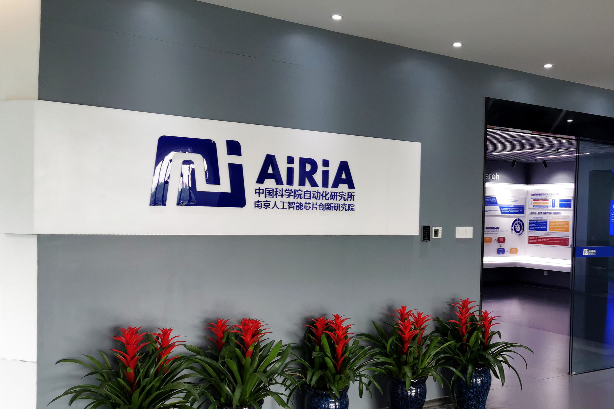

# AiRiA 工作日志

<p align='center'>

</p>

## 中国科学院自动化研究所南京人工智能芯片创新研究院
Nanjing Artificial Intelligence Chip Reseatch,  Institute of Automation，Chinese Academy of Sciences

[主页](http://www.airia.cn)

> 学习计划表 -> [SCHEDULE](https://github.com/Liuhongzhi2018/AiRiA/blob/master/SCHEDULE.md)

### 2020-08

- [八月第一周](https://github.com/Liuhongzhi2018/AiRiA/blob/master/WorkLog/2020-08-W1.md)

### 2020-08-07

- 定位代码中transfroms中MinIoURandomCrop问题，从master分支pull代码更新，恢复原先config文件注释部分进行训练；

- 修改pretrained model中的Key值，用MV2_SSDLite_convert.py配置文件进行训练。


### 2020-08-06

- 定位代码中transfrom问题，暂时先注释config文件的相应部分进行训练；

- Slim框架中训练的模型加载时需要修改key值。

### 2020-08-05

- 修改MobileNetV2\_SSD代码，迁移到AiriaCVLib框架，解决初始化权重和scores计算时的问题；

- 安装并配置flake8进行代码检查 [参考](https://blog.csdn.net/BNK_along/article/details/84000953)，写规范简洁的代码，并push到GitLab指定项目的mv2ssd分支。

### 2020-08-04

- 将MobileNetV2\_SSD代码push到研究院GitLab项目的新建 [分支](http://172.10.60.219/zhaoxin/Slim_Airiacvlib/tree/mv2ssd)

- 用行人检测器从爬取的图像中crop出person类。


### 2020-08-03

- 采用新SSDHead并加载wconv pretrained model，epoch 174时mAP达到0.19。

- 另一个实验将backbone部分中extra layers由vanilla conv改为Inverted，修改forward函数满足shape匹配；

- 之前尝试过TensorFlow转PyTorch模型，这篇可以尝试 [link](https://www.jianshu.com/p/0a61caeb693b)；

- tmux鼠标滚动方法：
```
ctrl+B
直接按[键 可滚动
q键 退出
```


### 2020-08-02

- 根据Tensorboard可视化的网络结构，进行分析；

- 修改MobileNetV2_SSD代码的SSDHead部分，用新SSDHead检测头和两个backbone进行实验。

### 2020-08-01

- 搭建Tensorflow Object Detection API合适的环境，学会安装和使用，编写inference [code](https://github.com/Liuhongzhi2018/AiRiA/blob/master/Source/inference_demo.py)进行测试；

- 编写代码 [code](https://github.com/Liuhongzhi2018/AiRiA/blob/master/Source/model_graph.py)，用Tensorboard 对 Tensorflow pretrained model (*.pb)进行可视化；
```
(remote-server) tensorboard --logdir=viusal_logs --port=6006
(local) ssh -L 16006:127.0.0.1:6006 zhuminchen@172.10.60.151
(local) http://localhost:16006/
```


- 根据可视化的图网络结构，修改MobileNetV2_SSD代码。


### 2020-07

- [七月第三周](https://github.com/Liuhongzhi2018/AiRiA/blob/master/WorkLog/2020-07-W3.md)
- [七月第四周](https://github.com/Liuhongzhi2018/AiRiA/blob/master/WorkLog/2020-07-W4.md)
- [七月第五周](https://github.com/Liuhongzhi2018/AiRiA/blob/master/WorkLog/2020-07-W5.md)


### 2020-07-31

- TensorFlow模型 转 PyTorch模型，代码梳理 [node 可视化](https://github.com/Liuhongzhi2018/AiRiA/blob/master/Source/node_visual.py)，[ckpt转h5模型](https://github.com/Liuhongzhi2018/AiRiA/blob/master/Source/transfer2h5_model.py)，[ckpt转pth模型](https://github.com/Liuhongzhi2018/AiRiA/blob/master/Source/save_pth_model)

```python
python save_pth_model.py --infile=./pretrained/ssdlite_mobilenet_v2_coco_2018_05_09/model.ckpt
```

- 实验，加载loc参数，配置文件config与MV\_SSD\_lr\_320.py相同。


### 2020-07-30

- 选择合适的行人检测器 [code](https://github.com/ultralytics/yolov3) 和 [weights](https://drive.google.com/drive/folders/1LezFG5g3BCW6iYaV89B2i64cqEUZD7e0)，对pan\_pa 和safe\_hat的persons类进行检测并crop出合适区域，然后进行数据清洗。

- TensorFlow Model Garden [link](https://github.com/tensorflow/models) 中COCO-trained models [link](https://github.com/tensorflow/models/blob/master/research/object_detection/g3doc/tf1_detection_zoo.md) 包含了 ssdlite\_mobilenet\_v2\_coco [weights](http://download.tensorflow.org/models/object_detection/ssdlite_mobilenet_v2_coco_2018_05_09.tar.gz)，COCO mAP 22与 [paper](http://openaccess.thecvf.com/content_cvpr_2018/papers/Sandler_MobileNetV2_Inverted_Residuals_CVPR_2018_paper.pdf) 指标接近。


### 2020-07-29

- 查看文件夹内文件总数和各个子文件夹内的文件数 [code](https://github.com/Liuhongzhi2018/AiRiA/blob/master/Source/count.sh)


### 2020-07-28

- 更改学习率策略[90,120,180]，epoch 156测试结果 mAP 达到0.183；
- Headpw检测头问题没法直接训练，修改depthwise conv和pointwise conv网络结构和groups参数，可以训练。

### 2020-07-27

- 复现 [mobileNetV2_SSD](https://github.com/ZhongyuanW/SSD_mobilenetv2-with-Focal-loss/)，预训练COCO2017预训练模型，更改class数量(80+1，1为负样本)；
- Facebook为PyTorch的可视化工具 [visdom](https://zhuanlan.zhihu.com/p/34692106) 进行训练loss可视化，开启visdom服务，然后连接ssh将服务器8097端口重定向，浏览器打开http://localhost:18097即可；
```
pip install visdom

python -m visdom.server -p 8097 

ssh -L 18097:127.0.0.1:8097 username@remote-server
```


### 2020-07-26

- 更改学习率策略[60,120]，epoch 200测试结果 mAP 达到0.177；
- 网络结构增加loc layers预训练层参数，采用相同的更改后的学习率，epoch 200测试结果达到0.179,指标提升；
- 整理AiriaCVLib框架的文件结构。


### 2020-07-25

- ECCV workshop AIM2020 image challenges [Extreme Inpainting: Track 2 Semantic Guidance](https://competitions.codalab.org/competitions/24676#results) 和 [Real Super-Resolution: Track 2 Upscaling x3](https://competitions.codalab.org/competitions/24681#results)。经验：网络深度，模型融合，数据增强。在SR任务上如何切分图像块(eg. 48 x 48)进行data preprocessing；
- 对更改学习率的训练结果进行测试，epoch 86达到17.0

### 2020-07-24

- 修改MobileNetV2_SSD代码，更新学习率设置lr\_conf step=[60,120]；
- 修改pretrained model权重的字典Key值，保留backbone和extra layers网络参数；
- 继续研究学习Airiacvlib框架。


### 2020-07-23

- 调研数据增强方式(主要MobileNetV2/SSD)
- 模型结构可视化Netron使用 [online](https://lutzroeder.github.io/netron/), [code](https://github.com/lutzroeder/Netron), [blog](https://www.jianshu.com/p/2d1291d69a54)
- 编写代码修改预训练权重的网络层，对字典重命名 [code](https://github.com/Liuhongzhi2018/AiRiA/blob/master/Source/rename_model.py)


### 2020-07-22

- mobilenetV2_SSD训练测试

### 2020-07-20

- [MobileNet从V1到V3](https://zhuanlan.zhihu.com/p/70703846)
- [MobilenetV2 TensorFlow 代码解读](https://zhuanlan.zhihu.com/p/51608073)

### 2020-07-15

- [mmdetection](https://github.com/open-mmlab/mmdetection)
